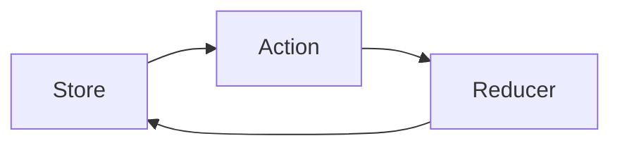
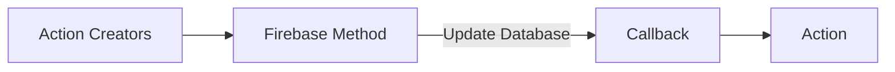

# [The Complete React Js and Redux Course - Build Modern Web Apps](https://learning.oreilly.com/videos/the-complete-react/9781789950656/)

# ES6 Crash Course 
    * Always use let over var as
        let - block scoped and does not allow redeclaration of variable in the scope
        var - function scoped and allow redeclaration 

    * const are blocked scoped 
        * we are not allowed to changes value of the object but we can change it's properties 

    * object - collection of properties associated with a varibale 

# React Intro
    * Compostional model - Everything is done with components. Complex components is combination of simple components 
    * Virtual DOM - comverts elements to Nodes 
        - components are made up of elements 
    * sudo npm install -g create-react-app my-app - for enabling facebook command for converting ES6 app to ES5 compatible code for browser. (babel : get browser-compatible javascript code ;; webpack )
    * npx create-react-app photoapp

## Element 
    * createElements can become pretty tedious and that's why we use JSX for this purpose 

## JSX
    * {} -  is used for javascript expression 
    
## Components 

# React- State Management 

## Class Components based photoapp 
    * https://github.com/gauravmahal/photoapp/tree/c0ee30cdb60e4eff01038f1f6a97f2b0bd5147ad

## Functional Components 
    * Convert class to function just by returning the value 

## State management 
    * Main component constructor is used for initialising the state of the applications
    * Updating state 
    
## Prop-Types
    * Require props must be passed in to the functions or abject or else it will throw error  

## [Lifecycle Methods](https://projects.wojtekmaj.pl/react-lifecycle-methods-diagram/)
    * constructor - called even before components instatnce is even inserted into DOM
    * componentWillMount <deprecated> - called before components is inserted into the Dom 
    * componentDidMount - called after components is inserted into the Dom 
    * componentDidUpdate - called whenever a component is re-rendered

# React-Router
    * Adding fucntionality to the page to enable single-Page
    * It become difficult to maintain navigation on url only through state management that's why wen need react router 

Divided into 3 parts 

## Browser-Router
    * used to keep track of URL changes 

## Link
    * component is used to invoke a change in the URL upon it being clicked on kind of hyperlink 

## Route
    * based on the URL we are going to have routes which contain the paths 

# Redux
    * Used for managing state of application
    * Give us an organised way to STORE our data 
    * State is Read-only 
    * All state changes are happening at a single place at root reducer 
    * Managing state is lot more predictable

[Draw Diagrams With Markdown](https://support.typora.io/Draw-Diagrams-With-Markdown/)

## Store 

## Reducer

## Actions

## Redux Devtools
[Github Repo](https://github.com/reduxjs/redux-devtools)
    * browser extension to show state changes 

# Firebase 
    * Real time dabase where we can save all our data that is inside our redux store

# React Hooks
    * they are use at the root of the functional component 
    * useState - for managing the state of the functional component 
            All states updates from one and the same synchronous event handler are batched together
    * useEffect - is used to manage the side effect i.e. what ever we can not manage using the normal component rendering flow
            gets executed right after component render cycle and it is executed for every render cycle 
            use it like this (**[]** as second argument) then useEffect() acts like **componentDidMount** and it run **ONLY ONCE** (after the first render)
            It can return a function which will be run when this useEffect will be run next time i.e. act like a clean up function 
            **Note** - If you have [] as dependencies then cleanup function runs when the component gets unmounted 
    * useCallback - allows to pass our function to only change when one of the inputs changes. It caches the function and it survives re-render cycle 
    * useRef - allows us to create a reference 
    * useReducer - used in place of useState when we have complex state logic to maintain 
    * useContext - 
    * useMemo - hook where you can save a value so it is not recreated with every render cycle
    * Custom hooks - share stateful logic across components and not data  

# Async/Await
    * Async must be present, always return a promise
    * Await wait till promise is settled 
    * error handling - try/catch block 